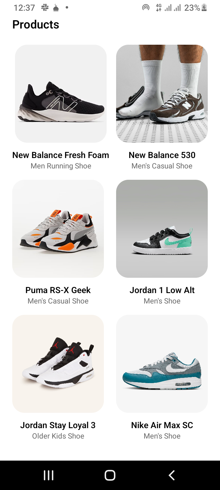
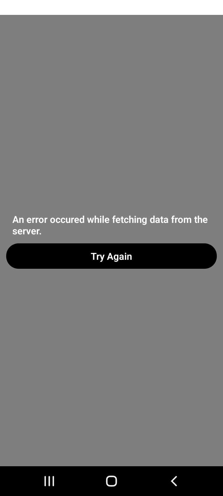

# Shoe Shopping App

An Android app that displays cool shoes. Built with React Native Expo.

## Screenshots

* Product Screen: Displays a list of products fetched from a backend implemented with timbu.cloud.
  

## Features

* Activity Indicator: On opening the app, immediately after the splash screen is shown, the activity indicator is displayed on the screen. The activity indicator hides when the fetch request to the backend fulfills or fails.
  

* Error Indicator: When the fetch request behind the scenes fails, an error indicator is displayed.
  

* Offline Notice: When there is no internet connection, an offline notice is shown on the screen.
  

## Virtualized Demo

View the virtualized demo on [appetize.io](https://appetize.io/app/b_qht4i2tlv4llopukw6zbwl246m)

## APK Download

Download the APK file to install the app on your Android device:

[Download APK](https://drive.google.com/file/d/15EPNEiGdXQYCWx8uTO0rBwVJUEq6RvMo/view?usp=sharing)
